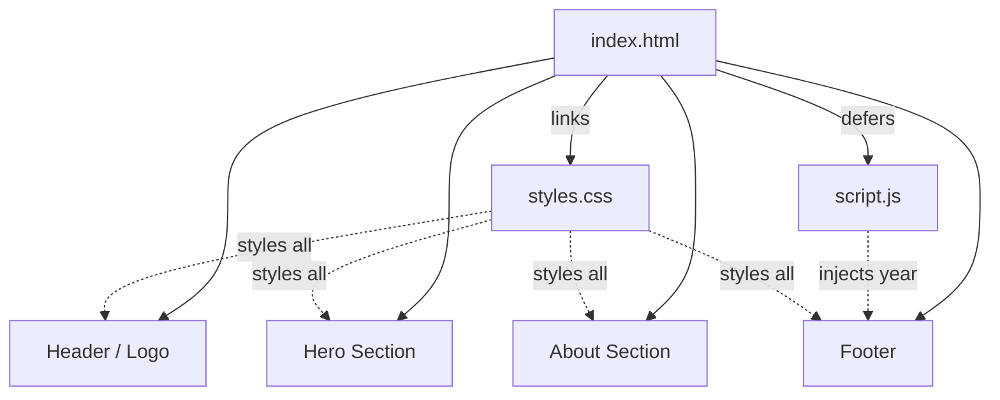
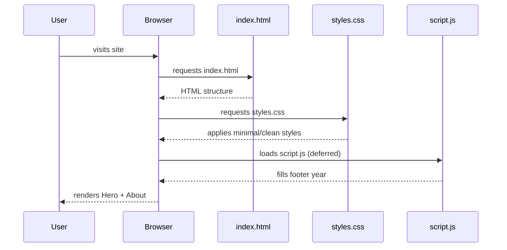

# Personal Bio Website

A minimal, mobile-responsive personal bio site built with plain HTML, CSS, and JavaScript — no frameworks, no build step.

## Project structure

```
Week 1/
├── index.html      # single-page layout (Hero + About)
├── styles.css      # mobile-first styling, breakpoint at 768px
├── script.js       # sets footer year
└── README.md       # you are here
```

## Site architecture



## Page flow



## Run locally

Open `index.html` directly, or serve the folder:

```bash
python3 -m http.server 8000
```

Then visit <http://localhost:8000>.

## Deploy

- **Netlify:** drag the `Week 1` folder onto <https://app.netlify.com/drop> for an instant URL
- **Vercel:** run `npx vercel` from the folder, or push to GitHub and import via vercel.com

## Customizing

Replace these placeholder tokens in `index.html`:

- `[Your Name]`
- `[Your Title / Tagline]`
- `[Your Bio]`

Tweak colors and spacing via the CSS custom properties at the top of `styles.css`:

```css
:root {
  --bg: #fdfdfc;
  --fg: #1a1a1a;
  --muted: #6b6b6b;
  --accent: #2a6df4;
}
```

## Roadmap

- [ ] Replace placeholders with real content
- [ ] Add social/contact links
- [ ] Optional: dark mode toggle
- [ ] Optional: portfolio/gallery section
