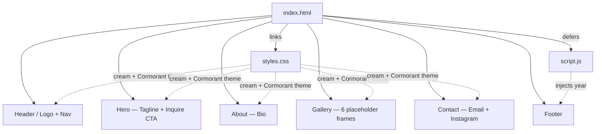
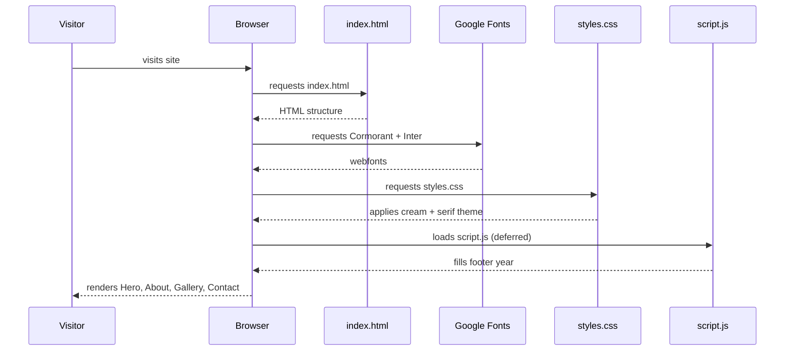

# Jay Lee Photography

A wedding photography portfolio website — minimal, mobile-responsive, built with plain HTML, CSS, and JavaScript. Editorial aesthetic: cream palette, italic serif headings (Cormorant Garamond), soft warm tones.

## Project structure

```
Week 1/
├── index.html      # single-page layout (Hero + About + Gallery + Contact)
├── styles.css      # cream/serif theme, mobile-first, breakpoint at 768px
├── script.js       # sets footer year
└── README.md       # you are here
```

## Site architecture



## Page flow



## Run locally

Open `index.html` directly, or serve the folder:

```bash
python3 -m http.server 8000
```

Then visit <http://localhost:8000>.

## Deploy

- **Netlify:** drag the `Week 1` folder onto <https://app.netlify.com/drop>
- **Vercel:** run `npx vercel` from the folder, or connect the GitHub repo at vercel.com

## Customizing

Replace the placeholder tokens in `index.html`:

- `[Your City]` — where you're based
- `[Your Region]` — where you primarily shoot
- `hello@jayleephotography.example` — real inquiry email
- Instagram link — your real handle
- The six `.ph` divs in the gallery — swap in real `` tags

Tweak the palette via the CSS custom properties at the top of `styles.css`:

```css
:root {
  --bg: #faf6f0;       /* cream background */
  --fg: #2b2622;       /* warm dark text */
  --accent: #b08968;   /* soft warm accent */
  --line: #e7dfd2;     /* dividers */
}
```

## Replacing gallery placeholders with real photos

In `index.html`, swap each `<div class="ph ph-N"></div>` with an ``:

```html
<figure class="card">
  
  <figcaption>Ceremony — Sonoma</figcaption>
</figure>
```

Add this to `styles.css` so images match the placeholder aspect ratio:

```css
.card img {
  width: 100%;
  aspect-ratio: 4/5;
  object-fit: cover;
  border-radius: 2px;
}
```

## Roadmap

- [ ] Replace placeholder gallery with real wedding photos
- [ ] Fill in city, region, real contact email, Instagram handle
- [ ] Add an Investment / Pricing section
- [ ] Add a Testimonials section
- [ ] Optional: lightbox viewer for the gallery
- [ ] Optional: contact form (Formspree / Netlify Forms)
